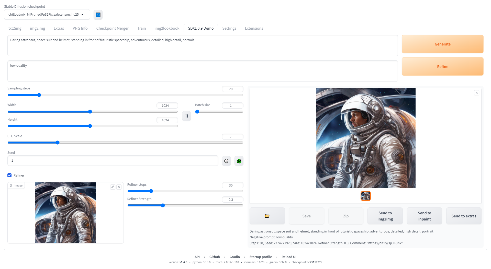
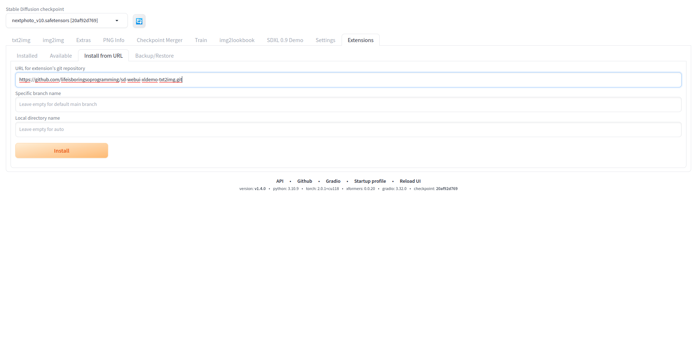

# Stable Diffusion XL 0.9 txt2img webui extension

A custom extension for [AUTOMATIC1111/stable-diffusion-webui](https://github.com/AUTOMATIC1111/stable-diffusion-webui) that demo the SDXL 0.9 txt2img features

# Tested environment
* GPU: RTX 3060 12G VRAM
* OS: Ubuntu 20.04.4 LTS, Windows 10
* RAM: 64G
* Automatic1111 WebUI version: v1.4.0
* python: 3.10.9
* torch: 2.0.1+cu118
* xformers: 0.0.20
* gradio: 3.32.0
* checkpoint: 20af92d769

# Overview
* This project allows users to do txt2img using the SDXL 0.9 base checkpoint
* Refine image using SDXL 0.9 refiner checkpoint
* Setting samplers
* Setting sampling steps
* Setting image width and height
* Setting batch size
* Setting CFG Scale
* Setting seed
* Reuse seed
* Use refiner
* Setting refiner strength
* Send to img2img
* Send to inpaint
* Send to extras

# Tutorial
There is a video to show how to use the extension

# Stable Diffusion extension
This project can be run as a stable Diffusion extension inside the Stable Diffusion WebUI.

## Installation for stable Diffusion extension
* Copy and paste `https://github.com/lifeisboringsoprogramming/sd-webui-xldemo-txt2img.git` to URL for extension's git repository
* Press Install button
* Apply and restart UI when finished installing

# Samplers mapping

|Sampler name|Diffusers schedulers class|
|---|---|
|dpmsolver_multistep|diffusers.schedulers.scheduling_dpmsolver_multistep.DPMSolverMultistepScheduler|
|deis_multistep|diffusers.schedulers.scheduling_deis_multistep.DEISMultistepScheduler|
|unipc_multistep|diffusers.schedulers.scheduling_unipc_multistep.UniPCMultistepScheduler|
|k_dpm_2_ancestral_discrete|diffusers.schedulers.scheduling_k_dpm_2_ancestral_discrete.KDPM2AncestralDiscreteScheduler|
|ddim|diffusers.schedulers.scheduling_ddim.DDIMScheduler|
|dpmsolver_singlestep|diffusers.schedulers.scheduling_dpmsolver_singlestep.DPMSolverSinglestepScheduler|
|euler_ancestral_discrete|diffusers.schedulers.scheduling_euler_ancestral_discrete.EulerAncestralDiscreteScheduler|
|ddpm|diffusers.schedulers.scheduling_ddpm.DDPMScheduler|
|euler_discrete|diffusers.schedulers.scheduling_euler_discrete.EulerDiscreteScheduler|
|k_dpm_2_discrete|diffusers.schedulers.scheduling_k_dpm_2_discrete.KDPM2DiscreteScheduler|
|pndm|diffusers.schedulers.scheduling_pndm.PNDMScheduler|
|dpmsolver_sde|diffusers.schedulers.scheduling_dpmsolver_sde.DPMSolverSDEScheduler|
|lms_discrete|diffusers.schedulers.scheduling_lms_discrete.LMSDiscreteScheduler|
|heun_discrete|diffusers.schedulers.scheduling_heun_discrete.HeunDiscreteScheduler|

# Limitations
* this extension does not work with other extension like control net
* this extension does not work with LoRA, textual inversion embeddings, etc

# YouTube Channel
Please subscribe to my YouTube channel, thank you very much. 

[https://bit.ly/3odzTKX](https://bit.ly/3odzTKX)

# Patreon
☕️ Please consider to support me in Patreon 🍻

[https://www.patreon.com/lifeisboringsoprogramming](https://www.patreon.com/lifeisboringsoprogramming)
